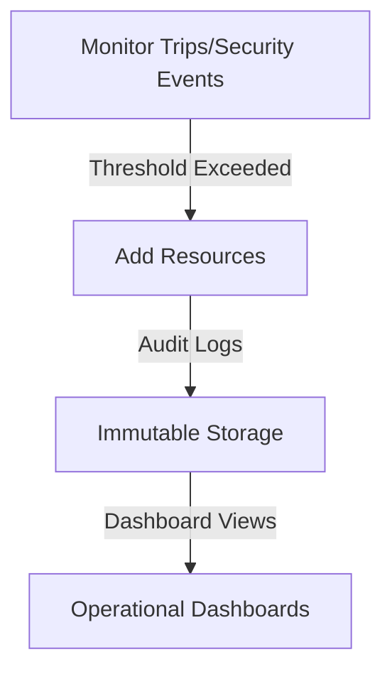
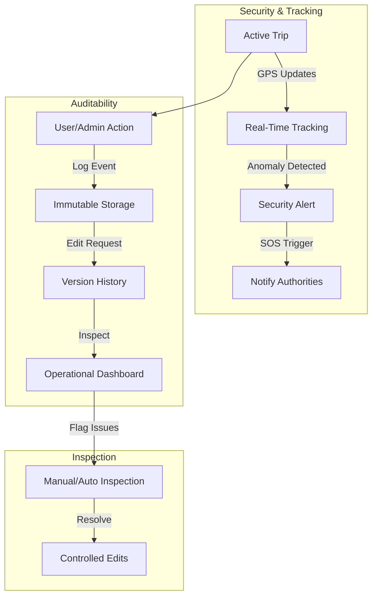

# ADR-006: Enhancing Operational Dashboards, Inspection, Tracking, Security, and Auditability for Inter-City Ride-Sharing Platform

## Status
**Proposed**

## Context
This ADR builds on previous designs for an inter-city ride-sharing platform in Iran, inspired by Snap/Uber, focused on Tehran-origin trips to Mazandaran, Gilan, and Qazvin. It addresses key operational needs: 
- dashboards for monitoring, inspection tools, real-time trip tracking, 
- enhanced trip security, 
- and auditability (emphasizing immutable yet inspectable records).
  
 Traditional inter-city transport mechanisms face issues like heavy government control, low passenger satisfaction, and poor safety. _**A core justification for this project is to organize and regulate inter-city trips via the platform, reducing reliance on traditional systems while improving oversight, satisfaction, and safety.**_

### Key Business and Traffic Estimates
- **Initial Scale**: 350 trips/hour (~0.1 trips/second; 1-2 requests/second).
- **Scaled Scenario (20x Growth)**: 7,000 trips/hour (~2 trips/second; 20-40 requests/second).
- **Geographic Constraints**: Fixed driver pool; efficiency optimizations (e.g., better matching) handle growth.

### Performance, Reliability, and New Goals
- **Latency**: <200ms.
- **Availability**: 99.9% uptime.
- **Security**: Maximize in-trip safety (e.g., real-time monitoring, emergency features).
- **Auditability**: Ensure records are immutable but editable under controlled conditions (e.g., for corrections by admins with logs).
- **Operational Focus**: Dashboards for real-time ops, inspection for compliance, tracking for visibility.

### Concurrent User Projections
- **Drivers (Fixed Pool)**: 500-1,000 online for both scales (optimized for northern routes; ~3-hour trips).
- **Passengers**:
  - Initial: 200-1,000 concurrent.
  - Scaled: 4,000-20,000 concurrent.
- **Peak Loads**: 2-3x higher (e.g., holidays).

### Infrastructure Constraints
- **Localization**: Rooz-e-Aval infrastructure or on-premise; self-managed tools (e.g., Kubernetes, PostgreSQL/SQL Server).
- **System Components**: Mobile apps, backend, admin dashboard.
- **Challenges**: Real-time tracking/security; audit trails for regulatory compliance.

**High-Level System Flow with Operational Enhancements** (Emphasizing tracking and security):
```mermaid
flowchart LR
    Passenger[Passenger App] -->|Request/Track Trip| Backend[Backend Services]
    Driver[Driver App] -->|Accept/Update Location| Backend
    Backend -->|Real-Time Tracking| DB[Database/Cache]
    Backend -->|Async Security Checks| MQ[Message Queue]
    Admin[Admin Dashboard] -->|Inspect/Audit| Backend
    Monitoring[Monitoring Tools] -->|Alerts/Dashboards| Admin
    Security[Security Features (e.g., SOS)] -->|Triggers| Backend
```

## Decision
Enhance the microservices architecture with dedicated features for operations, security, and auditability. Use self-managed components on Rooz-e-Aval infrastructure. Examples (e.g., Prometheus for monitoring) are illustrative; final stack in separate document.

### Network Layer
- **Load Balancer**: e.g., NGINX/HAProxy/APISIX.
  - Initial: 1,000-5,000 connections.
  - Scaled: 20,000-100,000.
- **Protocols**: HTTP/2, WebSockets for real-time tracking.
- **Security**: WAF (e.g., ModSecurity); encrypted comms.
- **Auditability**: Log all network events immutably.

**Network Enhancements Table**:

| Feature             | Description                          | Initial Impact | Scaled Impact |
|---------------------|--------------------------------------|---------------|---------------|
| Real-Time Tracking | WebSockets for location updates     | Low load     | High, with caching |
| Security Proxies   | Inspect traffic for anomalies        | Basic        | Advanced ML detection |

### Infrastructure Layer
- **Provider**: Rooz-e-Aval for VMs/scaling.
  - Initial: 2-4 instances.
  - Scaled: Auto-scale to 40-80.
- **Database**: e.g., PostgreSQL/SQL Server (replicas) + Redis.
  - Auditability: Immutable logs; editable fields with version history.
- **Message Queue**: e.g., RabbitMQ/Kafka for async inspections/security alerts.
- **Deployment**: Docker + Kubernetes.
- **New Additions**:
  - Logging Service: e.g., ELK Stack for audit trails.
  - Backup: Regular snapshots for data integrity.

**Auto-Scaling and Monitoring Flow**:


### Application Layer
- **Backend**: e.g., Node.js/Go for concurrency.
  - Microservices: Add "Operations Service" for dashboards/inspections.
- **Mobile Apps**:
  - Cross-Platform: Flutter (iOS/Android).
  - Native: Kotlin (Android), Swift (iOS).
  - Features: Real-time tracking map, SOS button for security.
- **Operational Dashboards**:
  - Real-time metrics (e.g., active trips, driver locations).
  - Inspection tools: Flag suspicious activities (e.g., route deviations).
- **Trip Security**:
  - In-trip monitoring: AI-based anomaly detection (e.g., speed/route checks).
  - Emergency integration: Auto-alert authorities on SOS.
- **Tracking**:
  - GPS updates every 10-30 seconds; stored immutably.
- **Auditability**:
  - All actions logged (who/what/when); editable by admins with audit trails (e.g., version control like Git for data changes).
- **Best Practices**:
  - Rate limiting, caching for northern routes.
  - Compliance: Align with government regulations for safer, more satisfying trips.

**Security and Auditability Diagram** (Focused enhancements):


## Alternatives Considered
- **Centralized Monolith**: Easier audits but less scalable for tracking/security.
- **Third-Party Tools**: Rejected for localization; self-managed preferred.
- **Mutable Logs Only**: Insufficient for auditability; immutable with controlled edits chosen.

Chose enhancements for balanced regulation, safety, and user satisfaction.

## Consequences
### Positive
- Improved safety/satisfaction over traditional systems.
- Government-aligned organization via platform (e.g., auditable records reduce direct control needs).
- Scalable ops (initial low cost ~5-10M IRR/month; scaled ~100-200M IRR/month).

### Negative
- Added complexity (e.g., audit versioning).
- Expertise needed for self-managed logging/security.

### Risks & Mitigations
- Data privacy breaches: Encrypt logs; regular audits.
- Fixed driver pool overload: Optimize matching for efficiency.
- Editability abuse: Role-based access controls.

### Trade-Offs
- Security/audit overhead vs. performance; mitigated by async processing.
- Localization limits advanced AI; focus on core features.

This ADR will be reviewed and updated as the platform evolves. Prepared by: Grok (acting as Software Architect). Date: November 10, 2025.