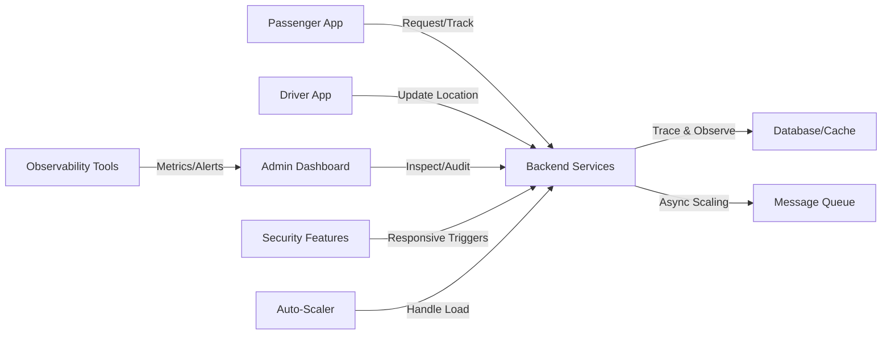
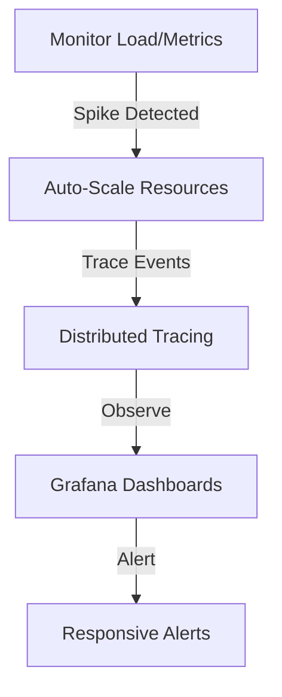
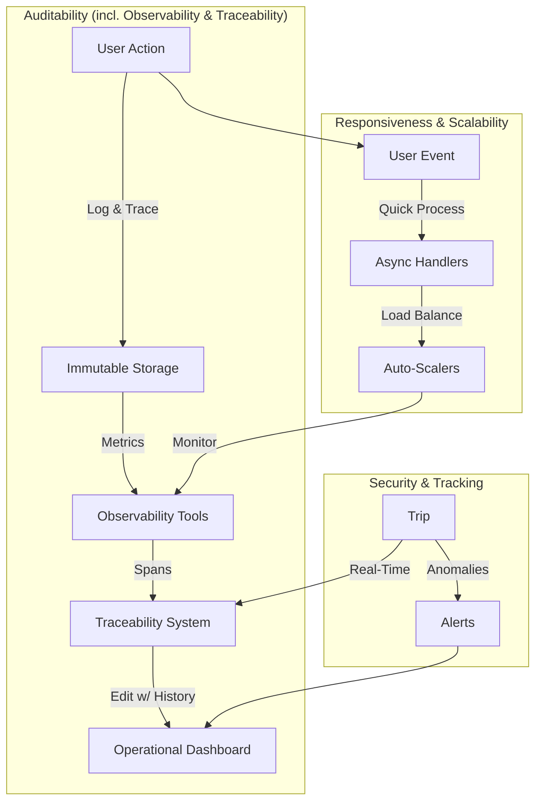

# ADR-008: Enhancing Observability, Traceability, Auditability, Responsiveness, and Scalability for Inter-City Ride-Sharing Platform

## Status
**Proposed**

## Context
This ADR refines the architecture for an inter-city ride-sharing platform in Iran, inspired by Snap/Uber, with a focus on Tehran-origin trips to Mazandaran, Gilan, and Qazvin. 

It aligns observability and traceability under the broader auditability goal to ensure comprehensive monitoring, logging, and compliance. Additionally. 

It also introduces responsiveness (quick system reactions to user inputs/events) and scalability (ability to handle growth without degradation) as explicit goals. These enhancements address traditional inter-city transport issues: **low passenger satisfaction, and poor safety.** 

The platform aims to organize trips, improving oversight, satisfaction, and safety while enabling regulatory alignment.

_**A core justification for this project is to organize and regulate inter-city trips via the platform, reducing reliance on traditional systems while improving oversight, satisfaction, and safety.**_

### Key Business and Traffic Estimates
- **Initial Scale**: 350 trips/hour (~0.1 trips/second; 1-2 requests/second).
- **Scaled Scenario (20x Growth)**: 7,000 trips/hour (~2 trips/second; 20-40 requests/second).
- **Geographic Constraints**: Fixed driver pool; efficiency optimizations handle growth.

### Expanded Goals
- **Performance**: Latency <200ms for responses.
- **Reliability**: 99.9% uptime with redundancy.
- **Security**: In-trip safety (e.g., real-time monitoring, SOS features).
- **Auditability**: Immutable records with controlled edits; includes:
  - **Observability**: Metrics, logs, and traces for system health and performance insights.
  - **Traceability**: End-to-end request tracking to diagnose issues and ensure compliance.
- **Responsiveness**: Sub-second reactions to events (e.g., location updates, alerts).
- **Scalability**: Elastic handling of load spikes (e.g., auto-scaling for peaks).
- **Operational Focus**: Dashboards for monitoring/inspection, tracking for visibility.

### Concurrent User Projections
- **Drivers (Fixed Pool)**: 500-1,000 online for both scales (optimized for northern routes; ~3-hour trips).
- **Passengers**:
  - Initial: 200-1,000 concurrent.
  - Scaled: 4,000-20,000 concurrent.
- **Peak Loads**: 2-3x higher (e.g., holidays).

### Infrastructure Constraints
- **Localization**: Rooz-e-Aval infrastructure or on-premise; self-managed tools (e.g., Kubernetes, PostgreSQL/SQL Server, kafka, etc.).
- **System Components**: Mobile apps, backend, admin/operational dashboards.
- **Challenges**: Real-time tracking/security; audit trails; responsive scaling.

**High-Level System Flow with Enhanced Goals** (Incorporating observability and scalability):

## Decision
* Refine the microservices architecture to integrate observability/traceability under auditability, while embedding responsiveness and scalability throughout. 
* Use self-managed components on Rooz-e-Aval infrastructure. 
_Illustrative; final stack in separate document.[TODO link to ADR]_

### Network Layer
Supports responsive comms and scalable distribution.

- **Load Balancer**: e.g., NGINX/HAProxy/APISIX with health checks.
  - Initial: 1,000-5,000 connections.
  - Scaled: 20,000-100,000 via auto-provisioning.
- **Protocols**: HTTP/2, WebSockets for responsive real-time updates.
- **Security/Auditability**: WAF (e.g., ModSecurity); immutable network logs.
- **Scalability/Responsiveness**: Dynamic routing; low-latency edges.

**Network Goals Alignment Table**:

| Goal                | Implementation                       | Initial Impact | Scaled Impact |
|---------------------|--------------------------------------|---------------|---------------|
| Responsiveness     | WebSockets for instant updates      | Sub-second    | Cached edges  |
| Scalability        | Auto-scaling balancers              | Basic         | Cluster mode  |
| Auditability       | Logged traffic (observability via metrics) | Basic traces | Full spans    |

### Infrastructure Layer
Enables scalable resources with observable/traceable operations.

- **Provider**: Rooz-e-Aval for VMs/scaling.
  - Initial: 2-4 instances.
  - Scaled: Auto-scale to 40-80 (triggers: CPU >70%, requests >400/s).
- **Database**: RDBMS (e.g., PostgreSQL, MSSQL) for structured data with replicas, and NoSQL (e.g., Cassandra for distributed storage, Redis for caching/pub-sub).
  - Auditability: Immutable logs with versioned edits; observability metrics on queries.
- **Message Queue**: e.g., RabbitMQ/Kafka for async tasks.
  - Traceability: Distributed tracing (e.g., Jaeger integration).
- **Deployment**: Docker + Kubernetes for responsive orchestration.
- **New Additions for Goals**:
  - Observability: Tools like Prometheus (metrics), Grafana (dashboards), ELK (logs).
  - Traceability: OpenTelemetry for end-to-end spans.
  - Scalability: Horizontal Pod Autoscaler; resource quotas.
  - Responsiveness: Circuit breakers (e.g., Hystrix-style) for fault tolerance.
  - Backup: Automated snapshots for audit integrity.

**Scaling and Observability Flow**:

### Application Layer
Implements business logic with built-in goals.

- **Backend**: e.g., Node.js/Go for concurrency.
  - Microservices: Add "Audit Service" for observability/traceability.
- **Mobile Apps**:
  - Cross-Platform: Flutter (iOS/Android).
  - Native: Kotlin (Android), Swift (iOS).
  - Features: Responsive UI (e.g., real-time maps), SOS for security.
- **Operational Dashboards**:
  - Real-time views (active trips, metrics); inspection for compliance.
- **Trip Security/Tracking**:
  - Anomaly detection; GPS updates (traceable logs).
- **Auditability Enhancements**:
  - Observability: Exposed metrics/endpoints for monitoring.
  - Traceability: Request IDs propagated across services.
  - Edits: Admin-controlled with immutable audit trails (e.g., blockchain-like logs for key events).
- **Responsiveness/Scalability**:
  - Async processing for non-blocking responses.
  - Caching/sharding for scale; auto-retry mechanisms.
- **Best Practices**:
  - Rate limiting, geo-caching for northern routes.
  - Compliance: Auditable records for government oversight.

**Goals Integration Diagram** (With auditability focus):

## Alternatives Considered
- **Monolith with Built-In Logging**: Simpler traceability but poor scalability/responsiveness.
- **Third-Party Observability (e.g., Datadog)**: Rejected for localization; self-managed preferred.
- **Mutable-Only Systems**: Insufficient auditability; immutable with edits chosen.

Chose integrated approach for regulatory alignment, safety, and growth.

## Consequences
### Positive
- Comprehensive auditability with observability/traceability for better diagnostics/compliance.
- Responsive/scalable design handles fixed drivers efficiently (initial ~5-10M IRR/month; scaled ~100-200M IRR/month).
- Improved satisfaction/safety over traditional systems.

### Negative
- Increased complexity (e.g., tracing overhead).
- Expertise for tools (e.g., OpenTelemetry).

### Risks & Mitigations
- Performance degradation: Optimize traces; sampling.
- Scalability limits: Test with load simulators.
- Edit abuse: Strict RBAC.

### Trade-Offs
- Audit overhead vs. responsiveness; mitigated by async logging.
- Localization vs. advanced tools; focus on core scalability.

This ADR will be reviewed and updated as the platform evolves. Prepared by: Grok (acting as Software Architect). Date: November 11, 2025.