# ADR-08: Inter-City Ride-Sharing Platform

## Status
Proposed

## Context
This ADR refines the architecture for an inter-city ride-sharing platform in Iran, inspired by Snap/Uber, with a focus on Tehran-origin trips to Mazandaran, Gilan, and Qazvin. 

We align observability and traceability under the broader auditability goal to ensure comprehensive monitoring, logging, and compliance. Additionally. 

We also introduces responsiveness (quick system reactions to user inputs/events) and scalability (ability to handle growth without degradation) as explicit goals. These enhancements address traditional inter-city transport issues: **low passenger satisfaction, and poor safety.** 

The platform aims to organize trips, improving oversight, satisfaction, and safety while enabling regulatory alignment.

_**A core justification for this project is to organize and regulate inter-city trips via the platform, reducing reliance on traditional systems while improving oversight, satisfaction, and safety.**_

### Key Business and Traffic Estimates
- **Initial Scale**: 350 trips/hour (~0.1 trips/second; 1-2 requests/second).
- **Scaled Scenario (20x Growth)**: 7,000 trips/hour (~2 trips/second; 20-40 requests/second).
- **Geographic Constraints**: Fixed driver pool; efficiency optimizations handle growth.

### Expanded Goals
- **Performance**: Latency <200ms for responses.
- **Reliability**: 99.9% uptime with redundancy.
- **Security**: In-trip safety (e.g., real-time monitoring, SOS features).
- **Auditability**: Immutable records with controlled edits; includes:
  - **Observability**: Metrics, logs, and traces for system health and performance insights.
  - **Traceability**: End-to-end request tracking to diagnose issues and ensure compliance.
- **Responsiveness**: Sub-second reactions to events (e.g., location updates, alerts).
- **Scalability**: Elastic handling of load spikes (e.g., auto-scaling for peaks).
- **Operational Focus**: Dashboards for monitoring/inspection, tracking for visibility.

---
### Business Goals
- Organize inter-city transport and ensure passenger safety.
- Increase satisfaction through real-time transparency.
- Enable regulatory oversight and compliance.

### Technical Goals
- Sub-200ms response times.
- 99.9% uptime.
- Full observability and traceability under auditability.
- Responsive scaling for peak travel seasons.
---

### Concurrent User Projections
- **Drivers (Fixed Pool)**: 500-1,000 online for both scales (optimized for northern routes; ~3-hour trips).
- **Passengers**:
  - Initial: 200-1,000 concurrent.
  - Scaled: 4,000-20,000 concurrent.
- **Peak Loads**: 2-3x higher (e.g., holidays).

### Infrastructure Constraints
- **Localization**: Rooz-e-Aval infrastructure or on-premise; self-managed tools (e.g., Kubernetes, PostgreSQL/SQL Server, kafka, etc.).
- **System Components**: Mobile apps, backend, admin/operational dashboards.
- **Challenges**: Real-time tracking/security; audit trails; responsive scaling.

**High-Level System Flow with Enhanced Goals** (Incorporating observability and scalability):

---

```mermaid
flowchart LR
    classDef svc fill:#f4f9ff,stroke:#1f78b4,stroke-width:1.5px,corner-radius:6px;
    classDef entity fill:#fef6e4,stroke:#f4a261,stroke-width:1.5px,corner-radius:6px;
    classDef infra fill:#f0fff4,stroke:#2a9d8f,stroke-width:1.5px,corner-radius:6px;
    classDef queue fill:#e8f5fd,stroke:#1d6fa5,stroke-width:1.5px,corner-radius:30px;
    classDef cache fill:#ffe5e5,stroke:#c53030,stroke-width:1.5px,corner-radius:6px,font-weight:bold;

    subgraph Clients
        RiderDriver[Passenger & Driver Apps]:::entity
        Admin[Admin Dashboard]:::entity
    end

    subgraph DC["Data Center / Backend Infrastructure"]
        
        %% Backend Services Matrix (Using invisible subgraphs for layout)
        subgraph Backend["Backend Services (Auto-scalable Microservices)"]
            direction TB
            subgraph Row1
                direction LR
                Identity[[Identity & Access]]:::svc
                Profile[[User Profile]]:::svc
                Trip[[Trip Management]]:::svc
                Matching[[Matching Service]]:::svc
            end
            subgraph Row2
                direction LR
                Pricing[[Pricing & Fare]]:::svc
                Payment[[Payment & Wallet]]:::svc
                Tracking[[Real-time Tracking]]:::svc
                Safety[[Safety & SOS]]:::svc
            end
            subgraph Row3
                direction LR
                Notify[[Notification]]:::svc
                AdminOps[[Admin & Ops]]:::svc
                Audit[[Audit & Logging]]:::svc
            end
        end

        %% Database Cluster
        subgraph DBCluster["Core DB Cluster"]
            direction LR
            DB1[(DB Node 1)]:::infra
            DB2[(DB Node 2)]:::infra
            DB3[(DB Node 3)]:::infra
        end

        Cache["🟥 Distributed Cache"]:::cache
        MQ([== Async Queue ==]):::queue
        Monitor[Monitoring & Alerts]:::infra
    end

    %% Styles to hide row borders
    style Row1 fill:none,stroke:none
    style Row2 fill:none,stroke:none
    style Row3 fill:none,stroke:none

    %% Connections
    RiderDriver <-->|Request / Response| Backend
    RiderDriver -->|Track & Location Updates| Backend
    Admin -->|Oversight| Backend

    Backend --> DB1
    Backend --> DB2
    Backend --> DB3
    
    Backend <--> Cache
    Backend --> MQ
    MQ --> Backend

    Backend --> Monitor
    Monitor -->|Alerts & KPIs| Admin
```

Here is the consolidated and refined **Decision** section for your ADR, keeping the professional tone of a CTO/Architect and merging your specific requirements.
	
## Decision

We decided to:

1.  **Adopt a Pragmatic Microservices Strategy (Evolving from Modular Monolith)**
    *   Start with a **Modular Monolith** organized by Domain-Driven Design (DDD) contexts to reduce initial operational complexity.
    *   Plan for a phased decoupling of high-volatility/high-traffic domains (**Matching, Trip Management, Real-time Tracking, Payment**) into independent microservices as load increases alongside the **20x growth** target.
    *   Implement an **Event-Driven Architecture** using **Kafka** to decouple services, ensure reliable message delivery, and feed real-time analytics and audit logs.

2.  **Elevate Auditability to a First-Class Architectural Citizen**
    *   Treat **Observability (Metrics, Logs) and Traceability** as non-negotiable requirements for regulatory compliance and operational oversight.
    *   Enforce **OpenTelemetry** standards and immutable structured logging across all modules to ensure end-to-end request tracking and system health visibility (aiming for **99.9% uptime**).

3.  **Ensure Responsiveness and Scalability via Modern Protocols & Infrastructure**
    *   Achieve **sub-200ms latency** and handle real-time scenarios (Driver Location, SOS) using 
		**gRPC** for inter-service communication and 
		**WebSockets/HTTP/2** for client connectivity.
    *   Host all core services on **self-managed "Rooz-e-Aval" infrastructure**, leveraging **Kubernetes** and **Horizontal Pod Autoscaling (HPA)** to manage load spikes elasticity.

4.  **Align Technology Selection with Local Operational Realities**
    *   Select the technology stack (e.g., Flutter, Go lang, .NET Core, SQL Server, Redis, Kafka) based on **ease of DevOps implementation** on self-hosted infrastructure.
    *   Prioritize technologies with strong **talent availability in the Iranian market** and robust open-source community support to mitigate hiring risks and ensure maintainability.

### Application Layer
Implements business logic with built-in goals.

- **Backend**: e.g., .NET Core/Go for concurrency.
  - Microservices: Add "Audit Service" for observability/traceability.
  - Domain-Driven Design (DDD) contexts defined in **[ADR-09: Domain & Service Boundaries](./adr-09-domain-service-boundaries-14040909.md)**.
- **Mobile Apps**:
  - Cross-Platform: Flutter (iOS/Android).
  - Native: Kotlin (Android), Swift (iOS).
  - Features: Responsive UI (e.g., real-time maps), SOS for security.
- **Operational Dashboards**:
  - Real-time views (active trips, metrics); inspection for compliance.
- **Trip Security/Tracking**:
  - Anomaly detection; GPS updates (traceable logs).
- **Auditability Enhancements**:
  - Observability: Exposed metrics/endpoints for monitoring.
  - Traceability: Request IDs propagated across services.
  - Edits: Admin-controlled with immutable audit trails (e.g., blockchain-like logs for key events).
- **Responsiveness/Scalability**:
  - Async processing for non-blocking responses.
  - Caching/sharding for scale; auto-retry mechanisms.
- **Best Practices**:
  - Rate limiting, geo-caching for northern routes.
  - Compliance: Auditable records for government oversight.

### Network Layer  
**Supports responsive comms, scalable distribution, and protocol-specific handling for real-time vs. web service calls.**

- **Load Balancer**: e.g., NGINX/HAProxy/APISIX with health checks and protocol-aware routing.  
  - **Initial**: 1,000–5,000 concurrent connections.  
  - **Scaled**: 20,000–100,000 via auto-provisioning and horizontal scaling.  
  - **Protocol Routing**:  
    - **HTTP/2 or HTTP/3 (QUIC)** → REST/gRPC APIs (web service calls).  
    - **WebSockets (wss://)** → Real-time bidirectional streams.  
    - **gRPC over HTTP/2** → Internal microservice calls (high-performance, typed contracts).

- **Protocols – Detailed Use Cases**:

  | Protocol       | Primary Use Case                     | Why It Fits                                                                 | Performance Notes                                                                 |
  |----------------|--------------------------------------|-----------------------------------------------------------------------------|-----------------------------------------------------------------------------------|
  | **HTTP/2**     | RESTful web service calls (e.g., trip booking, user auth, payment init) | Multiplexing, header compression, server push; reduces latency for API calls | Ideal for bursty, request-response traffic; supports 100s of concurrent streams per connection |
  | **HTTP/3 (QUIC)** | Future-proof web service calls (optional upgrade path) | 0-RTT connection resumption, better mobile performance on lossy networks | Recommended for mobile clients; self-managed via Caddy or custom QUIC-aware LB |
  | **WebSockets** | Real-time updates (location tracking, trip status, chat, SOS alerts) | Full-duplex, persistent, low overhead after handshake | Essential for driver/passenger live sync; sticky sessions required |
  | **gRPC**       | Inter-service communication (matching, pricing, audit events) | Efficient binary serialization (Protobuf), streaming support | Use internally; terminate at API gateway for external clients |

- **Security & Auditability**:  
  - WAF: e.g., ModSecurity or Coraza (open-source) with rules for OWASP Top 10.  
  - TLS 1.3 everywhere; mTLS for internal gRPC.  
  - Immutable network logs: Forward access/error logs to centralized observability (e.g., Loki/ELK) with tamper-proof retention.

- **Scalability & Responsiveness**:  
  - **Dynamic Routing**: Path-based routing (e.g., `/api/*` → HTTP/2, `/ws/*` → WebSocket).  
  - **Low-Latency Edges**: Deploy edge terminators in Rooz-e-Aval regions closest to Tehran/northern provinces.  
  - **Connection Management**:  
    - Reuse TCP connections via keep-alive.  
    - WebSocket ping/pong for heartbeat and fast failure detection.  
  - **Rate Limiting & Backpressure**: Per-IP and per-user throttling at LB to protect real-time streams.

**Network Goals Alignment Table**:

| Goal                | Protocol/Mechanism                          | Initial Impact               | Scaled Impact                     |
|---------------------|---------------------------------------------|------------------------------|-----------------------------------|
| **Responsiveness**  | WebSockets + HTTP/2 multiplexing            | <100ms update delivery       | Cached + edge-terminated streams  |
| **Scalability**     | Auto-scaling LB + protocol-aware clustering | Handles 5k conn/node         | 100k+ via sharded LB instances     |
| **Auditability**    | Immutable logs + request tracing headers    | Basic access logs            | Full correlation IDs across spans |
| **Security**        | TLS 1.3, WAF, mTLS for gRPC                 | Encrypted at rest/in-flight  | Zero-trust enforced at edge       |

**Recommendation Summary**:  
- Use **HTTP/2** as default for all API calls.  
- Use **WebSockets** exclusively for real-time features.  
- Introduce **gRPC** internally for microservices (via service mesh if needed later).  
- Plan for **HTTP/3** as a non-blocking upgrade for mobile resilience.  
- Enforce **sticky sessions** only for WebSockets; stateless for HTTP/gRPC.

### Infrastructure Layer
Enables scalable resources with observable/traceable operations.

- **Provider**: Rooz-e-Aval for VMs/scaling.
  - Initial: 2-4 instances.
  - Scaled: Auto-scale to 40-80 (triggers: CPU >70%, requests >400/s).
- **Database**: RDBMS (e.g., PostgreSQL, MSSQL) for structured data with replicas, and NoSQL (e.g., Cassandra for distributed storage, Redis for caching/pub-sub).
  - Auditability: Immutable logs with versioned edits; observability metrics on queries.
- **Message Queue**: e.g., RabbitMQ/Kafka for async tasks.
  - Traceability: Distributed tracing (e.g., Jaeger integration).
- **Deployment**: Docker + Kubernetes for responsive orchestration.
- **New Additions for Goals**:
  - Observability: Tools like Prometheus (metrics), Grafana (dashboards), ELK (logs).
  - Traceability: OpenTelemetry for end-to-end spans.
  - Scalability: Horizontal Pod Autoscaler; resource quotas.
  - Responsiveness: Circuit breakers (e.g., Hystrix-style) for fault tolerance.
  - Backup: Automated snapshots for audit integrity.

## Consequences
- Increased observability adds minor overhead (~5-10%) in latency.
- Rooz-e-Aval self-management implies higher DevOps responsibility.
- Clear separation of protocols simplifies scaling but adds gateway complexity.

## Risk factors
...?!

